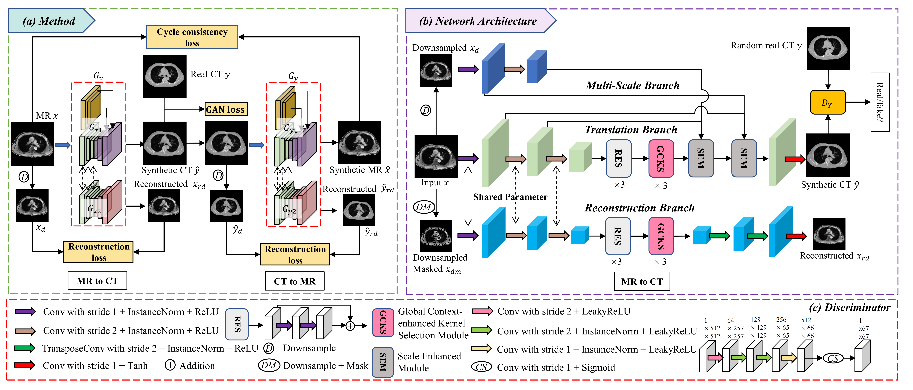

# DMFI-Net
We provide Pytorch implementations for our paper [Dynamic Multi-scale Feature Integration Network for Unsupervised MR-CT Synthesis](https://www.sciencedirect.com/science/article/pii/S0893608025004642) (Neural Networks) by Meng Tang, Jiuming Jiang, Xue Zhang, Tao Zhou, Yizhe Zhang, Bin Qiu, and Li Zhang.
  
## 1. Introduction

We propose DMFI-Net to complete unsupervised MR-CT translation.

<p align="center">
     <br />
    <em> 
    Figure 1. An overview of the proposed DMFI-Net.
    </em>
</p>

**Preview:**

Our proposed methods consist of three main components to utilize multi scale information: 

- GCKS ( Global Context-enhanced Kernel Selection).

- SEM (CScale Enhancement Module ).

- scale-aware reconstruction branch.

## 2. Getting Started

- ### Installation

  Install PyTorch and torchvision from http://pytorch.org and other dependencies. You can install all the dependencies by
  ```bash
   conda install --yes --file requirements.txt
  ```
  
- ### Dataset Preparation

  Download [CERMEP-IDB-MRXFDGV](https://ejnmmires.springeropen.com/articles/10.1186/s13550-021-00830-6) dataset. Or download [MR and CT data with multiobserver delineations of organs in the pelvic area-Part of the Gold Atlas project](https://portal.research.lu.se/en/publications/mr-and-ct-data-with-multiobserver-delineations-of-organs-in-the-p/) dataset. 


- ### Date Preprocessing

  After preparing all the data, you should process all the data to ensure quality. Then save the MR and CT data as npy files to speed up data loading. You can refer to the `data/MultiDataLoader.py` file for data loading.

- ### training

  Carefully review the code in `EN2CTTrain.py`, including the parameter settings, then run `bash multiTrain.sh`. For instance, increase `num_workers` to speed up training.  And `gpu_ids` to set the gpu that we use. The weights will be saved in `./checkpoints/`.


- ### Test

  When training is completed, the weights will be saved in `./checkpoints/`. Then, run `bash multiTest.sh`, and the synthesized image will be saved in `./results/`, and can obtain the PSNR, SSIM, and NMSE values by `python getMetrics.py`.

## 3. Citation

```bibtex
@article{tang2025dynamic,
  title={Dynamic Multi-scale Feature Integration Network for unsupervised MR-CT synthesis},
  author={Tang, Meng and Jiang, Jiuming and Zhang, Xue and Zhou, Tao and Zhang, Yizhe and Qiu, Bin and Zhang, Li},
  journal={Neural Networks},
  pages={107584},
  year={2025},
  publisher={Elsevier}
}
```